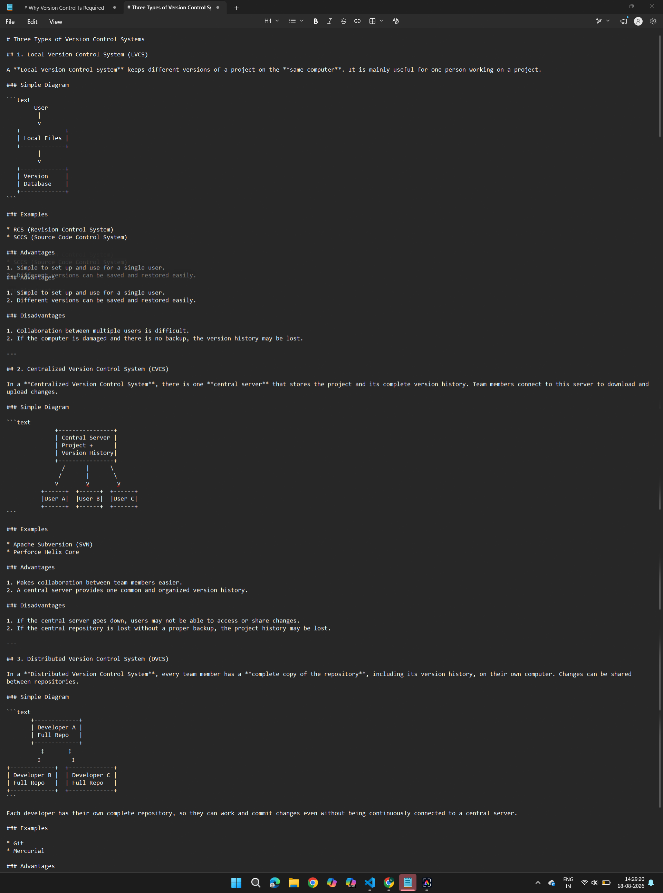

# Version Control Systems Assignments

### Assignment 1: Understanding the Need for VCS

**Question 1:**  Explain why Version Control is required.

**Tasks:**
1. Write a short real-life example (similar to `final.doc`, `final2.doc`, `final_final.doc`) showing problems without VCS.
2. List at least **5 problems** that occur when multiple people work on files without Version Control.
3. In your own words, define what a **Version Control System (VCS)** is.
4. Write 3 benefits of using a VCS in a college project or team project.

**Question2:** Understand the three types of VCS with examples and diagrams.

**Tasks:**
1. Explain the following with **simple diagrams** (hand-drawn or digital):
   - Local Version Control System
   - Centralized Version Control System (CVCS)
   - Distributed Version Control System (DVCS)
2. Give **2 examples** of each type.
3. Write **2 advantages and 2 disadvantages** of each type.
4. Which type is Git? Justify your answer in 3–4 lines.

